# Engagement Prediction Pipeline

```mermaid
graph LR
    GCS["GCS\nBluesky Firehose\n(likes, posts, embeds)"]

    subgraph S1 ["01 · Get Data"]
        S1_desc["Stream & filter from GCS\nHash-sample users\nWrite embeddings memmap"]
    end

    subgraph S2 ["02 · Target Posts"]
        S2_desc["Pair liked posts with negatives\nAssign train / val / holdout splits"]
    end

    subgraph S3 ["03 · User History"]
        S3_desc["Build prior-like embedding\nindex per target row\nCap history length"]
    end

    subgraph S4 ["04 · Train"]
        S4_desc["MLP or Two-Tower model\nBCE loss · Early stopping\nAdamW + LR scheduling"]
    end

    subgraph S5 ["05 · Evaluate"]
        S5_desc["Modular eval suite\nCold-start · Diversity\nTrait amplification"]
    end

    GCS -->|"likes\nposts\nembeddings"| S1

    S1 -->|"posts_core\nlikes_core\nembeddings.npy"| S2
    S2 -->|"target_posts\n(pos/neg pairs + splits)"| S3
    S3 -->|"history_posts\n(prior_emb_indices)"| S4
    S4 -->|"predictions\n(train/val/holdout)"| S5

    S1 -.->|"embeddings.npy\n(shared memmap)"| S4
```

## Stage Summary

| Stage | Purpose | Key Outputs |
|-------|---------|-------------|
| **01 · Get Data** | Stream likes/posts from GCS, hash-sample users, compute & write embeddings | `posts_core`, `likes_core`, `embeddings.npy`, `inferences_core` |
| **02 · Target Posts** | Pair each liked post with a time-bucketed negative; assign temporal + user splits | `target_posts` (pos/neg pairs with train/val/holdout split) |
| **03 · User History** | Build per-target prior-liked-post embedding indices, capped by recency | `history_posts` (prior_emb_indices per target) |
| **04 · Train** | Train MLP or Two-Tower engagement model with BCE loss and early stopping | Model checkpoints, TorchScript, predictions, training plots |
| **05 · Evaluate** | Run modular evaluation: cold-start curves, diversity, trait amplification, inequality | `eval_summary.json`, per-module plots and CSVs |
